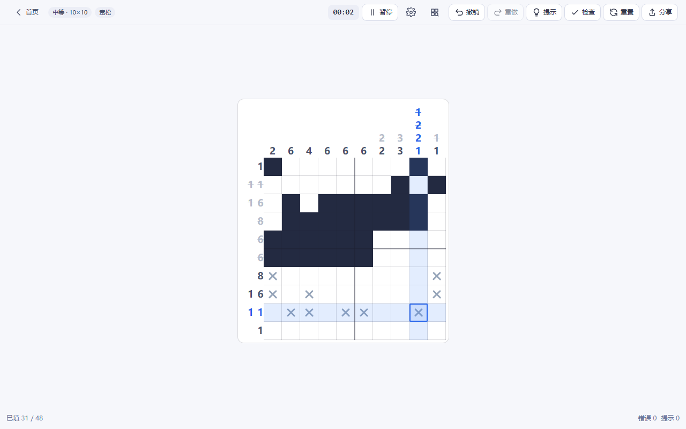
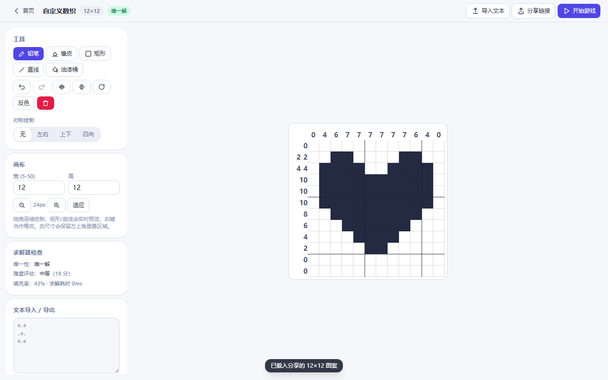
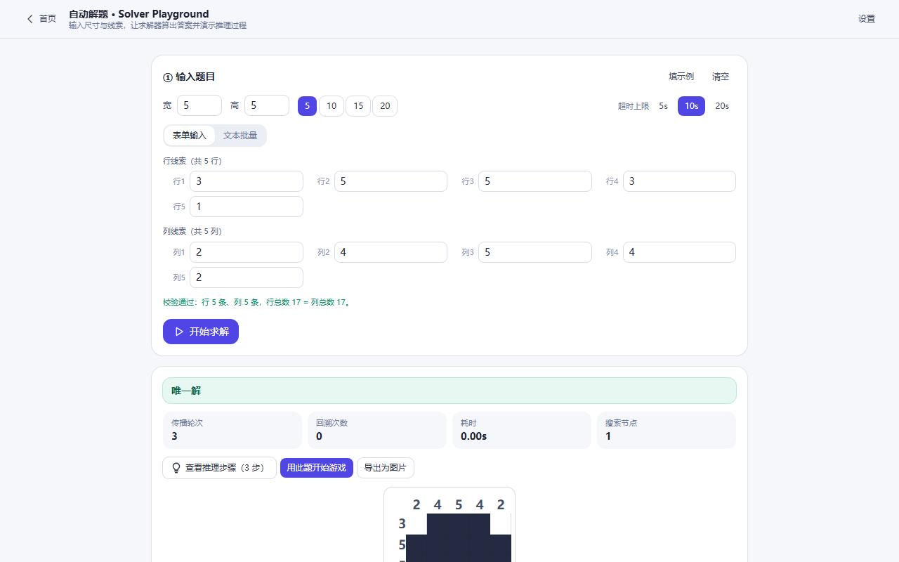
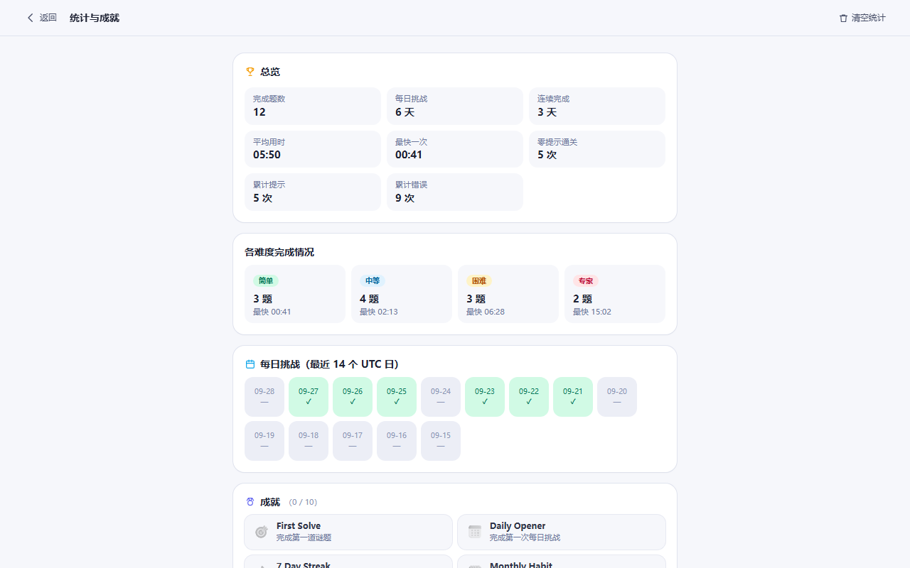
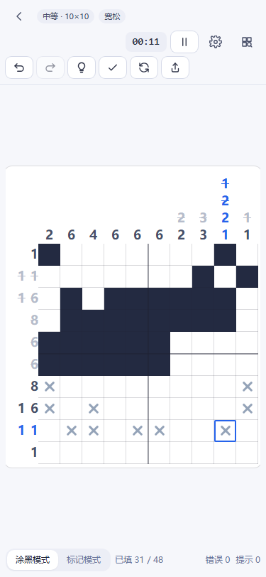

# 🧩 Nonogram Online · 在线数织游戏

一款打开网页就能玩的**在线数织游戏**（Nonogram / Picross）：**自动生成谜题 + 按求解成本分级难度 + 每日挑战 + 自定义编辑器 + 自动解题演示 + 成绩与成就统计**。
零后端、无需注册，全部逻辑都在浏览器里跑，构建产物是一份纯静态站点。

<p>
  <a href="https://rusheng-world.github.io/nonogram-online/"></a>
  <a href="https://github.com/rusheng-world/nonogram-online"></a>
  <a href="https://github.com/rusheng-world/nonogram-online/issues"></a>
</p>

> **▶ 在线试玩：<https://rusheng-world.github.io/nonogram-online/>**
> 打开就能玩，桌面端与手机端都支持。

## 📸 界面预览

| 首页 | 游戏 |
| --- | --- |
|  |  |

| 自定义编辑器 | 自动解题 |
| --- | --- |
|  |  |

| 统计与成就 | 设置 |
| --- | --- |
|  |  |

| 手机端 · 首页 | 手机端 · 游戏 |
| --- | --- |
|  |  |

## ✨ Features

- **自动生成谜题**：给定种子就能复现同一道题；每道题都经求解器验证，**保证有解且唯一解**。
- **难度由算法评估**：不看尺寸看「求解成本」（回溯次数、假设链深度、长线索交叉），并尽量压掉全空 / 全满的退化行列。
- **每日挑战**：按 UTC 日期派生种子，同一天全世界拿到同一道题，刷新不换题，跨零点自动换题。
- **自定义数织**：画布编辑（铅笔 / 橡皮 / 矩形 / 直线 / 油漆桶 / 翻转 / 旋转 / 对称绘制）或文本导入导出，实时算线索、实时检查唯一解，并可生成分享链接。
- **自动解题（Solver Playground）**：只填尺寸和线索，自动判定唯一解 / 多解 / 无解，支持逐步演示推理过程、导出图片、一键「用此题开始游戏」。
- **完整游戏体验**：三种正误判定模式、计时与暂停遮罩、撤销 / 重做（≥ 200 步）、提示、悬停高亮行列、线索自动划线（可开关）、键盘与触摸全支持。
- **成绩与统计**：每题的最佳成绩本地保存（区分「不限条件」与「零提示」），统计页汇总完成数、连续天数、平均 / 最快用时、各难度完成情况、最近对局；10 项成就解锁时有轻量提示。
- **保存与分享**：进度自动存档、刷新可恢复；可分享谜题链接，也可用系统分享面板分享成绩。
- **观感与无障碍**：亮 / 暗 / 跟随系统主题、网格辅助线、音效开关；棋盘带 `role="grid"` 与逐格 `aria-label`，尊重 `prefers-reduced-motion`。

## 🎮 Game Modes

| 模式 | 入口 | 说明 |
| --- | --- | --- |
| 普通游戏 | 首页 → 选择难度 | 四档难度，自动生成、唯一解校验 |
| 每日挑战 | 首页 → 每日挑战 | 每天一道固定题，UTC 口径，同一世界同题 |
| 自定义 | 首页 → 自定义数织 | 自己画或导入，算线索后可开始游戏 |
| 自动解题 | 首页 / 游戏页 → 自动解题 | 输入线索让程序求解并演示推理 |

四档难度对应固定的**正方形**盘面（边长一定是 5 的倍数）：

| 难度 | 盘面 | 目标填充率 | 判定标准（求解器口径） |
| --- | --- | --- | --- |
| 简单 | 5 × 5 | 40% – 60% | 纯行列约束传播即可解出，无需回溯 |
| 中等 | 10 × 10 | 45% – 62% | 需要多轮交叉传播，回溯 0 – 2 次 |
| 困难 | 15 × 15 | 50% – 68% | 需要 3 – 10 次回溯，或存在长线索交叉 |
| 专家 | 20 × 20 | 52% – 70% | 回溯超过 10 次，或需要深层假设链 |

## 🧠 Puzzle Generation

生成流程（`src/core/generator.ts`）：

1. **可复现随机**：种子（seed）经 `mulberry32` 派生伪随机序列，同一 seed 永远生成同一道题（每日挑战、分享链接都依赖这一点）。
2. **图案成形**：不是纯噪声，而是「随机团块生长 + 对称镜像 + 少量噪声」混合，让图案看起来像有意义的图形；填充率按难度区间控制。
3. **算线索**：由图案算出每行 / 每列的线索（`src/core/clues.ts`）。
4. **求解器验证**：验证有解且**唯一解**，同时记录推理轨迹用来评估难度。
5. **难度打分**：把求解成本映射成分数并落到目标区间，不达标就换种子重试；带最大重试次数与超时保护，超时则放宽条件或退回上一个可用谜题。
6. **退化线控制**：优先丢弃含「全空行 / 全满行 / 全空列 / 全满列」的盘面，困难与专家档要求为 0 条。

生成性能（本机实测，`pnpm puzzle:qa --count=20`，Node.js 24 / Windows，每档 20 题，随机种子前缀 `qa`）：

| 难度 | 盘面 | 平均耗时 | 最慢耗时 |
| --- | --- | --- | --- |
| 简单 | 5 × 5 | 0.4 ms | 2.3 ms |
| 中等 | 10 × 10 | 8.7 ms | 37.1 ms |
| 困难 | 15 × 15 | 158.2 ms | 329.2 ms |
| 专家 | 20 × 20 | 1.3 ms | 4.0 ms |

- 困难档因为要求「必须有回溯」，是最慢的一档；换一批随机种子实测为平均 158 – 233 ms、最慢约 0.65 s，仍在 1 秒预算内。
- 专家档盘面更大，传播一步能确定的格子更多，反而收敛得更快。
- 这些是本机单次测量的结果，不是跨设备的系统性基准测试。

> **关于难度**：`difficultyScore`（代码里的 `solverDifficultyScore`）衡量的是「本程序求解这道题的推理成本」，是一个**启发式指标**，并不完全等同于人类玩家的实际体感——同一个分数，有人觉得轻松，有人可能卡很久。界面上的「预计用时」同理，仅供参考。

## 📱 Mobile Support

- 断点覆盖 320 / 375 / 390 / 412 / 768 px 竖屏与横屏，**375 px 宽度下棋盘完整可操作、无横向滚动**。
- 触摸操作齐全：**单击**填 / 空切换、**长按**打 X 标记、**拖拽**连续绘制；底部提供「填充模式 / 标记模式」切换，长按作为辅助。
- 棋盘**不会抢走页面的上下滚动**：只有真正产生位移的绘制手势才会被拦截，从棋盘上开始上下滑动依然能正常滚动页面。
- 小巧思：`dvh` 高度、Safe Area 内边距、暂停遮罩，横屏下棋盘也不会被裁掉。

## 💾 Save & Share

- **本地存储**：所有数据都在 `localStorage`，统一走 `src/core/storage.ts` 一层封装，带 **schema 版本号 + 数据迁移 + JSON 损坏自愈 + localStorage 不可用时降级到内存**，未来改数据结构不会让旧存档直接崩掉。
- **自动存档**：进度、计时、错误次数、提示次数都会保存；刷新或重开浏览器可继续同一道题。
- **最佳成绩**：按「难度 + 图案指纹」分组，分开记录「不限条件最佳」与「零提示最佳」，避免用大量提示刷出的成绩污染无提示成绩。
- **分享谜题**：把尺寸 + 图案 + 难度用紧凑编码塞进 URL hash（`#/play?p=…`），对方打开就是同一道题。
- **分享成绩**：优先调起系统分享面板（Web Share API），不支持时自动退化成复制到剪贴板。

存储键一览（都在 `localStorage`）：

| 键 | 内容 |
| --- | --- |
| `nonogram-schema` | schema 版本号（当前 `2`） |
| `nonogram-settings-v1` | 设置 |
| `nonogram-progress-v1` | 当前对局存档 |
| `nonogram-records-v1` | 各题最佳成绩 |
| `nonogram-history-v1` | 历史成绩（上限 200 条） |
| `nonogram-daily-v1` | 每日挑战记录 |
| `nonogram-achievements-v1` | 成就解锁状态 |
| `nonogram-solver-history-v1` | 自动解题最近 10 次输入 |

## 🛠️ Tech Stack

| 层 | 选型 |
| --- | --- |
| 构建 | Vite 5 |
| 框架 | React 18 + TypeScript（strict） |
| 样式 | Tailwind CSS 3（CSS 变量做 Design Token） |
| 状态 | Zustand 4（选它而不是 Context + reducer：棋盘与设置是高频更新且跨页面共享的状态，Zustand 的订阅粒度更细，能避免整棵树重渲染，代码也更短） |
| 测试 | Vitest 2 + @vitest/coverage-v8 |
| 质量 | ESLint 9（flat config）+ Prettier 3 + GitHub Actions |
| 重计算 | Web Worker（自动解题在 worker 里跑，避免卡 UI） |

版本号规则：`主版本.次版本.修订号`。**修订号（第三位）只用于修 bug**（`1.0.1 → 1.0.2`），**次版本（第二位）用于实质性功能增加**（`1.0.1 → 1.1.0`）。版本号在 `package.json`、`src/project.ts`、Git tag 中保持一致。

## 🚀 Development

### 环境要求

| 依赖 | 版本 |
| --- | --- |
| Node.js | **18 LTS 或更高**（CI 用 22，推荐 20 / 22 LTS） |
| 包管理器 | pnpm（推荐，CI 使用）或 npm |

没装 Node.js：到 <https://nodejs.org/> 下载 LTS 版本，安装时保持默认选项，装完**重新打开终端**。想用 pnpm：

```bash
npm i -g pnpm     # 或：corepack enable && corepack prepare pnpm@latest --activate
pnpm -v
```

### 方式 A：一键脚本（Windows，双击即可，最省事）

| 脚本 | 作用 |
| --- | --- |
| `start.bat` | 检查 Node.js → 首次自动装依赖 → 检查 5173 端口占用（被占用可一键结束占用进程）→ 启动开发服务器并自动打开浏览器 |
| `build.bat` | 检查环境 → 生产构建到 `dist/` → 本地预览并打开浏览器 |
| `share.bat` | 生产构建后用静态服务器挂在 5173 端口，适合配合内网穿透（frp / nps / ngrok）分享给别人玩 |

直接双击即可，不需要敲任何命令。

### 方式 B：命令行

```bash
npm install          # 或 pnpm install
npm run dev          # 开发服务器，默认 http://localhost:5173
```

常用脚本：

| 命令 | 说明 |
| --- | --- |
| `pnpm dev` | 启动开发服务器（热更新） |
| `pnpm build` | 类型检查 + 生产构建，产物在 `dist/` |
| `pnpm preview` | 本地预览构建产物（预览端口 4173） |
| `pnpm share` | 构建后用 5173 端口对外提供静态站点（公网分享用） |
| `pnpm test` | 跑单元测试 |
| `pnpm test:coverage` | 跑测试并输出覆盖率 |
| `pnpm lint` / `pnpm lint:fix` | ESLint 检查 / 自动修复 |
| `pnpm format` / `pnpm format:check` | Prettier 格式化 / 检查 |
| `pnpm puzzle:qa --count=20` | 题目质量验证 CLI（见下） |

### 常见问题

- **`Port 5173 is already in use`**：上一次的开发服务器还开着。关掉那个窗口，或直接双击 `start.bat`——它会检测占用并让你一键结束占用进程。也可以换端口：`pnpm dev --port 5174`。
- **中文乱码 / 脚本报错**：Windows 下请用项目自带的 `.bat` 脚本，它们已经处理了代码页与换行符问题。
- **依赖装不上**：先确认 Node.js 版本 ≥ 18；仍失败可删掉 `node_modules` 重装。

## 🧪 Testing

```bash
pnpm test              # 178 个用例，14 个测试文件
pnpm test:coverage     # 带覆盖率
pnpm puzzle:qa --count=20   # 题目质量验证报告
```

单元测试重点覆盖三层：

- **`src/core/`**（约 87% 语句覆盖）：求解器（唯一解 / 多解 / 无解）、线索计算（含全空行、全满行、单格行等边界）、生成器（唯一解比例、可复现性、难度达标、退化线）、编码 / 分享码往返、存档与迁移、成就与每日挑战、编辑器图案导出。
- **`src/store/`**：棋盘状态机（判定模式与罚时、撤销 / 重做上限、提示、暂停、胜利判定与成绩落库）。
- **`src/game/`**：开局引导（分享码 / 存档 / 谜题 id 三条恢复路径）与「新开一局 == 刷新后同一道题」。

与机器快慢有关的性能断言不作为测试门禁：断言「生成质量」时统一使用**不限时预算**（候选搜索只受次数上限约束），这样同一份代码在本地、覆盖率插桩和 CI 上都会得出相同结论。

`puzzle:qa` 是一个**开发用**的题目质量验证工具（不在普通用户界面里），会随机生成若干题并输出「唯一解比例 / 线索一致性 / 难度达标率 / 退化线数量 / 生成耗时」报告：

```bash
pnpm puzzle:qa --count=100 --difficulty=hard --seed=my-seed
```

本仓库**未引入 Playwright 等端到端测试框架**；交互部分以人工在桌面与移动尺寸下验证为主。

## 📁 Project Structure

```text
src/
  core/         领域逻辑（与 React 无关，可独立测试）
    clues.ts          线索计算
    solver.ts         约束传播求解器 + 假设分支 + 提示 + SolveResult
    difficulty.ts     求解成本 → 难度评分
    generator.ts      谜题生成（图案成形 / 唯一解校验 / 难度筛选）
    rng.ts            可复现伪随机（mulberry32）
    storage.ts        localStorage 统一封装（schema / 迁移 / 降级）
    encoding.ts       分享码编解码
    dailyChallenge.ts 每日挑战（UTC 派生种子）
    achievements.ts   成就规则
    statistics.ts     统计聚合
    solver*.ts        自动解题的输入校验 / 步骤折叠 / worker 客户端
  store/        应用状态（Zustand：game / editor / settings）
  game/         对局启动与引导
  components/   UI 组件（棋盘 / 线索条 / 解题棋盘 / 步骤播放器 / 通用控件）
  pages/        首页 / 游戏 / 编辑器 / 自动解题 / 统计 / 设置
  workers/      Web Worker（自动解题）
tests/          单元测试
scripts/        开发脚本（puzzle-qa）
docs/           截图
```

## 🧩 Core Algorithm

**线索计算**：把连续填充段转成「段长列表」，全空行记为 `[]`（渲染时显示为 `0`）。`1×N`、单行全满、全空行等极端情况都有对应测试。

**约束传播（求解器核心，`src/core/solver.ts`）**：对每一行 / 每一列用**动态规划**计算「在满足该线索的所有排布里，第 i 格能否为黑、能否为白」，取交集得出必然确定的格子——而不是枚举所有排列（25 长度的排布数会爆炸）。反复迭代行 / 列传播直到不再产生新确定格。

**假设分支**：传播卡住时，选一个未确定格分别尝试黑 / 白并递归，用于①找到第 2 个解即证明非唯一、②评估难度。分支格的选择有固定策略（优先线索约束更强、位于最长线索中间位置附近的格子），并带**步数上限与超时**，避免死循环。

**难度评分（`solverDifficultyScore`）**：综合「需要的最高推理层级 + 回溯次数 + 假设链深度 + 传播轮数 + 长线索交叉」映射到 0–100 分，再按分数区间归入四档。它是**启发式指标**，衡量的是程序求解成本，不等同于人类体感。

**提示**：沿求解器的推理顺序找出「玩家还没弄对的第一格」作为逻辑提示；当纯逻辑推不出来时，退化为在未知格最少的线上揭示一格（会标记为「猜测提示」）。

## 🌐 Deployment

构建产物是纯静态文件（`dist/` 里只有 `index.html` + JS + CSS + 图标），任何静态托管都能放。`vite.config.ts` 里 `base: './'` 让同一份产物既能在子路径（GitHub Pages）也能在根路径部署。

### GitHub Pages（本仓库采用，自动化）

仓库自带的 `.github/workflows/deploy.yml` 会在推送 `main` 时自动构建并发布到 GitHub Pages：

1. 把代码推到 `main`；
2. Actions 依次执行 **安装 → 校验（lint / format / test）→ 构建 → 发布**；
3. 在仓库 **Settings → Pages → Source** 选择 **GitHub Actions**；
4. 稍等片刻，站点就会出现在 `https://<用户名>.github.io/<仓库名>/`。

本项目当前地址：**<https://rusheng-world.github.io/nonogram-online/>**。

### Vercel / Netlify / Cloudflare Pages

- **构建命令**：`pnpm build`
- **输出目录**：`dist`
- 三者都能直接识别 Vite 项目；因为是 hash 路由（`#/...`），不需要额外配置 SPA 重写规则。

### 自己动手做静态预览 / 公网分享

```bash
pnpm build            # 生成 dist/
pnpm preview          # 本地静态预览（4173）
pnpm share            # 用 5173 端口对外提供，便于配合 frp / nps / ngrok 内网穿透
```

`share.bat` 就是 `pnpm share` 的一键版本：双击即可，适合把游戏临时分享给朋友。

## 📌 Known Limitations

- **难度是启发式的**：`solverDifficultyScore` 衡量程序求解成本，不等同于人类体感；界面上的「预计用时」也只是参考值。
- **无 PWA / 离线能力**：没有 service worker，断网后无法继续玩；也未提供「安装到主屏」。
- **未引入 E2E 自动化测试**：Playwright 等框架未接入，交互主要靠人工在桌面与移动尺寸下验证。
- **自动生成仅四档固定尺寸**（5 / 10 / 15 / 20），不是任意尺寸；想要别的尺寸请用自定义编辑器。
- **没有系统性性能基准**：README 里的耗时是本机单次测量，不是跨设备 / 多轮的基准结论。
- **没有后端**：没有账号系统，数据只存在当前浏览器；换设备或清空浏览器数据后成绩不会同步。
- **提示是「揭格」式**：直接在棋盘上揭示一格，没有做「只给线索提示」的多级提示。

## 🤝 Contributing

欢迎提 Issue 与 PR：

1. Fork 本仓库并从 `main` 切出分支；
2. 保证 `pnpm lint && pnpm format:check && pnpm test && pnpm build` 全部通过；
3. 提交 PR 并说明改动动机与验证方式。

发现 bug 请到 <https://github.com/rusheng-world/nonogram-online/issues> 反馈。

## 📄 License

本项目以 MIT 许可证开源，详见 [LICENSE](LICENSE)。

## Development Notes

本项目（代码、测试、脚本与文档）在开发过程中使用 AI 模型 **deepseek-v4.1-flash** 辅助生成，测试、验证与后续维护由 [rusheng-world](https://github.com/rusheng-world) 负责。所有性能数字均来自本仓库的实际运行结果。
